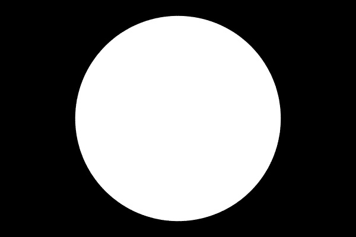
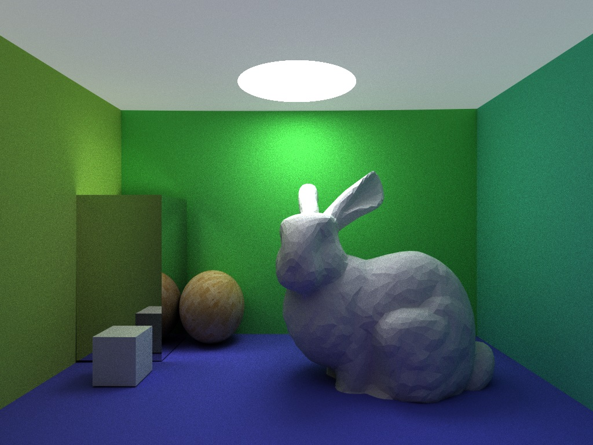
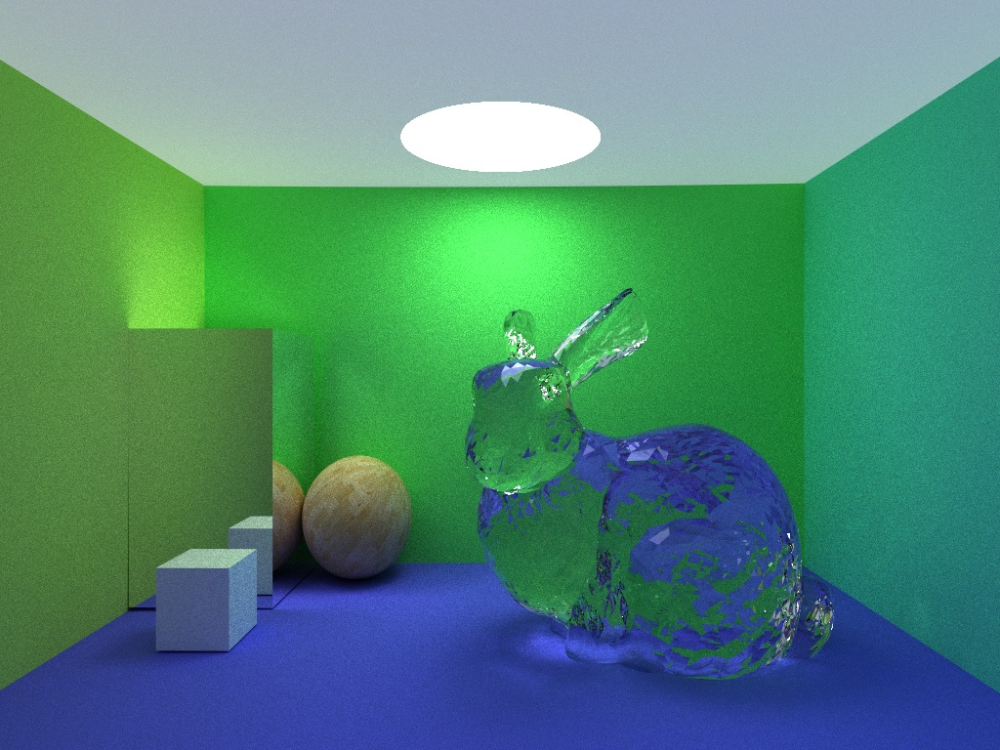
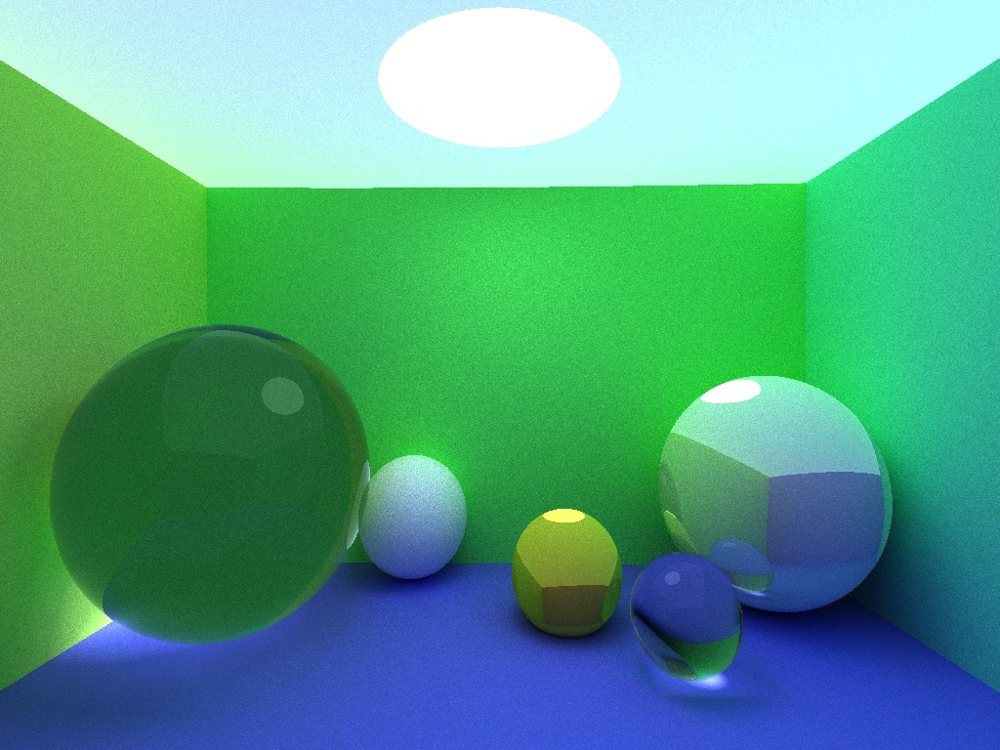
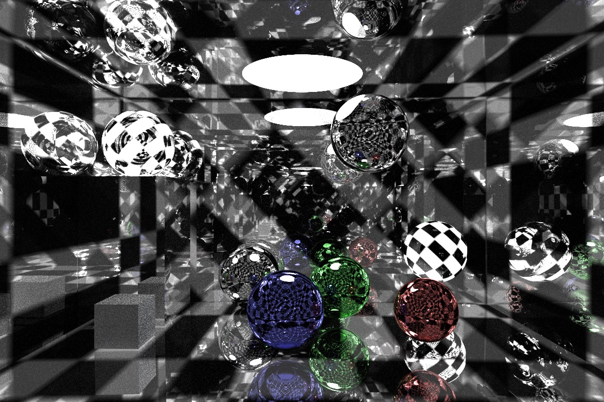
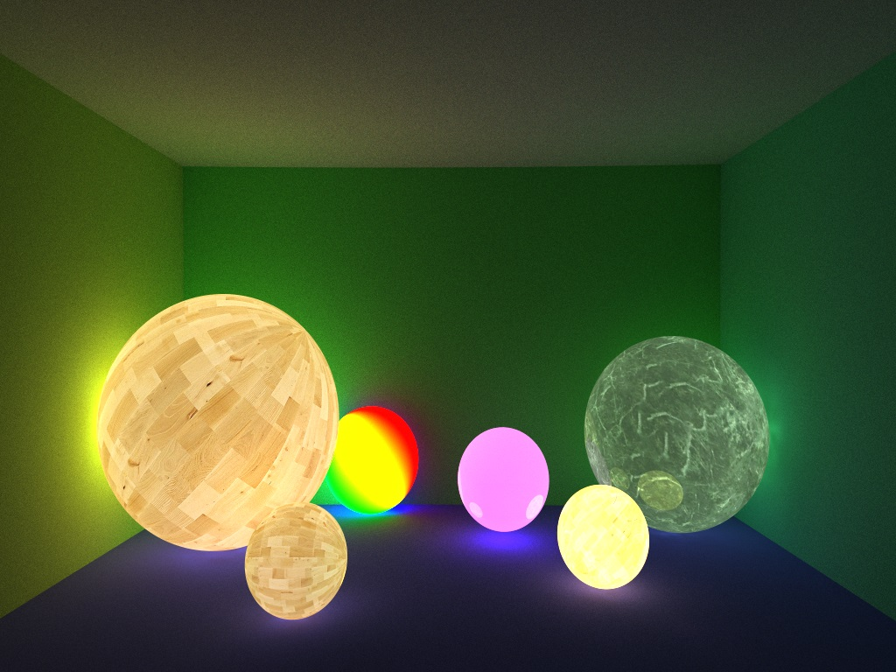

# Ray Tracing #

A highly OOP implementation of Monte-Carlo Ray Tracing rendering 

## Feature ##

* Image display based on Windows GDI
* Load and render .obj objects
* Speed up ray-object collision check with oct-tree 
* Sphere, box and triangle supported
* Soft shadow
* Three types of surface
	- reflection
	- refraction
	- diffusion
* Area light and volume light supported
* Texture
* Complex scene generator for video
* Anti-aliasing
* Field depth

## Dependencies ##

This is an independent project without any third party libraries. 

This project can be successfully built by Visual Studio 2012 and latter. It is not a cross-platform project for now.  

## Results ##

### Anti-aliasing ###

</img>

Original

</img>

Anti-aliased

### .obj rendering###

</img>

diffusing rabbit (281 iters)

</img>

diffusion rabbit (937 iters)

Glass rabbit(678 iters, depth of sub-lights: 10）

### light spot and recursive mirror ###

### Texture lightening ###

### Field depth ###

### Full video ###

See [Full Video here](www.youtube.com/watch?v=Nm3q0iIu2xY).

## References

* [https://www.cs.unc.edu/~rademach/xroads-RT/RTarticle.html](https://www.cs.unc.edu/~rademach/xroads-RT/RTarticle.html "https://www.cs.unc.edu/~rademach/xroads-RT/RTarticle.html")
* smallpt project

## Contact

A Chinese version of readme in detail is available. 

You can contact [monocofe@gmail.com](mailto:monocofe@gmail.com) for more information.

